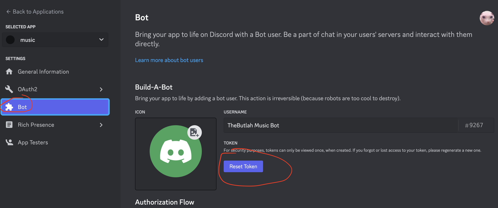

  

Aoede is a Discord music bot that **directly** streams from **Spotify to Discord**. The only interface is Spotify itself.

**Note**: a Spotify Premium account is currently required. This is a limitation of librespot, the Spotify library Aoede uses. Facebook logins [are not supported](https://github.com/librespot-org/librespot/discussions/635).

## 💼 Usecases

- Small servers with friends
- Discord Stages, broadcast music to your audience

## 🏗 Usage

(Images are available for x86 and arm64.)

### Notes:
⚠️ Aoede only supports bot tokens. Providing a user token won't work.

Aoede will appear offline until you join a voice channel it has access it.

You must create a [new developer application](https://discord.com/developers/applications). Then go to the application, click on the "Bot" tap, click "Reset Token", and paste the token into the `config.toml` file (see config.example.toml).

Likewise, fill out the rest of the fields in `config.toml`.

### Building from source:

Requirements:

- [Rust/Cargo](https://rustup.rs)

Run `cargo build --release`. This will produce a binary in `target/release/aoede`. Set the required environment variables (see the Docker Compose section), then run the binary.
